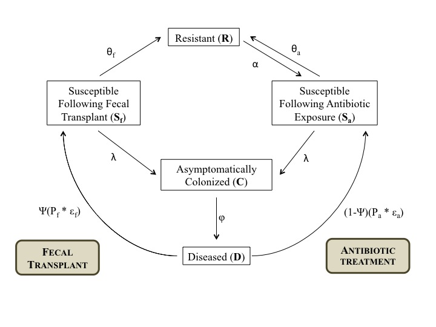

\newpage

```{r chunks, echo=FALSE}
knitr::opts_chunk$set(echo=FALSE,
                      message=FALSE,
                      eval=FALSE)
```

```{r libs}
# libraries
library(deSolve)
library(ggplot2)
library(dplyr)
library(tidyr)
theme_set(theme_classic())

# programs
source("../R/model.R")
source("../R/stochasticModel.R")
source("../R/calcR0.R")
```

```{r params}
# parameters
a.r <- 0.75
a.s <- a.s.abx <- 0.22
a.cn <- a.cp <- a.c <- 0.01
a.d <- 0.01
alpha <- 0.5
theta <- 0.033
theta.abx <- 0.033
theta.ft <- 1.0
beta.c <- beta.d <- 0.007
f <- 0.6
epsilon <- epsilon.abx <- 0.1
epsilon.ft <- 1.0
p <- p.abx <- 0.8
p.ft <- 0.9
psi <- 0.2
phi <- 0.04
k.r <- 0.33
k <- 0.15
k.d <- 0.068

# sequence of times
max.time <- 2.5e1
times <- seq(0, max.time, 1) 

# delta
delta <- 1e-1
```

```{r old-model, eval=TRUE}
# parameter vector
param <- c(a.r=a.r, a.s=a.s, a.cn=a.cn, a.cp=a.cp, a.d=a.d, alpha=alpha,
           theta=theta, beta.c=beta.c, beta.d=beta.d, f=f, 
           epsilon=epsilon, p=p, phi=0.2, k.r=k.r, k=k, k.d=k.d)

# initial state
initial.state <- c(R=1e3, S=0, P=0, C=1e1, D=0)

model.old <- lsoda(initial.state, times, dx.dt.orig, param, delta=delta)
```

```{r new-model, eval=TRUE}
# parameter vector
param <- c(a.r=a.r, a.s.abx=a.s.abx, a.c=a.c, a.d=a.d, alpha=alpha,
           theta.abx=theta.abx, theta.ft=theta.ft, beta.c=beta.c, beta.d=beta.d,  
           epsilon.abx=epsilon.abx, p.abx=p.abx, phi=phi, k.r=k.r, k=k, k.d=k.d,
           epsilon.ft=epsilon.ft, p.ft=p.ft, psi=psi)

# initial state
initial.state <- c(R=1e3, S.ft=0, S.abx=0, C=1e1, D=0)

model.new <- lsoda(initial.state, times, dx.dt.new, param, delta=delta)
```

```{r new-model-valid, eval=TRUE}
# parameter vector
param <- c(a.r=a.r, a.s.abx=a.s.abx, a.c=a.c, a.d=a.d, alpha=alpha,
           theta.abx=theta.abx, theta.ft=theta.ft, beta.c=beta.c, beta.d=beta.d,  
           epsilon.abx=epsilon.abx, p.abx=p.abx, phi=phi, k.r=k.r, k=k, k.d=k.d,
           epsilon.ft=epsilon.ft, p.ft=p.ft, psi=0)

# initial state
initial.state <- c(R=1e3, S.ft=0, S.abx=0, C=1e1, D=0)

model.new.valid <- lsoda(initial.state, times, dx.dt.new, param, delta=delta)
```

# Introduction
*Clostridium difficile* (*C. difficile*) infection (CDI) represents the
most common healthcare-acquired infection in the United States
(@lessa_mu). Between 2000 and 2010, rates of *C. difficile*
hospitalizations more than doubled, and CDI now constitutes nearly
half of a million infections per year. These infections exert a significant
population health and economic toll: CDI has emerged as the leading
cause of gastroenteritis-associated death, accounting for more than
14,000 U.S. deaths per year, and entails excess yearly hospital costs of
more than \$1 billion (@miller_chen).

*C. difficile* is particularly vexing in healthcare settings because of
high patient susceptibility and easily facilitated transmission. *C.
difficile* is a Gram-positive bacteria that may sometimes be present
asymptomatically in small numbers in the intestinal tract (such
individuals are “colonized”). During and following antibiotic exposure,
however, as other gut flora die off, an ecologic vacuum is created in
which *C. difficile* rapidly replicates. *C. difficile* produces an
exotoxin, which at high bacterial loads will cause 
severe diarrhea — that is, CDI. Hospitalized patients, who frequently
take antibiotics, are at high risk of CDI, and it is estimated that CDI
risk increases 6-fold during antibiotic
exposure and in the month following  (@thomas,@hensgens). Moreover, both asymptomatically colonized
and actively diseased individuals shed *C. difficile* in stool and can
contaminate healthcare workers and surrounding environments. In
particular, *C. difficile* is capable of forming spores which can
survive for long periods on fomites and are not killed by alcohol-based
hand sanitizers (@wilcox). For these reasons, inter-patient spread and
CDI outbreaks are common in healthcare environments. The standard
treatment for CDI is antibiotics, generally metronidazole, vancomycin,
or fidaxomicin, but recurrence rates following treatment are high
(@austin-matthew).

Reducing the burden of healthcare-associated CDI represents an ongoing
focus of infection control and antimicrobial stewardship initiatives.
Better understanding *C. difficile* transmission in healthcare
environments is integral to these efforts. In “Epidemiological Model for
*Clostridium Difficile* Transmission in Health-Care Settings,” published
by Lanzas *et al.* in 2011, the authors developed a compartmental
mathematical model of *C. difficile* nosocomial transmission (the
“*Lanzas* model”) (@lanzas). Their paper highlighted the importance of
patient-to-patient transmission to *C. difficile* burden in hospital
settings, as the authors found that the transmission coefficients
associated with colonized and/or symptomatically diseased patients were
significant drivers of whether R-0 was greater or less than 1. Since the
paper’s 2011 publication, however, fecal transplantation to restore
endogenous flora has gained increasing acceptance as a curative therapy
for *C. difficile*. This therapy, in which donor feces is administered
through nasogastric tube (or less commonly, endoscopy, colonoscopy or
enema), restores normal gut flora that prevents *C. difficile*
overgrowth, and thus toxin production, and provides resistance against
repeat *C. difficile* colonization (“colonization resistance”). In
studies, fecal transplant has cured recurrent or refractory CDI in \>
90% of patients (@austin-matthew).

Unsurprisingly, fecal transplant’s impressive clinical results have
garnered considerable coverage in recent published literature. Its
implications for nosocomial transmission, however, have received
significantly less attention. Yet, fecal transplant is faster than
antibiotic treatment (\~8-24 hours versus 10 days), and often restores
gut bacterial diversity and resolves symptomatology nearly
immediately (@bakken-johan). These effects fundamentally alter patient
susceptibility and recovery rates and thus are likely to influence *C.
difficile* transmission dynamics. Therefore, in the present paper, our
objective was to update the *Lanzas* model to incorporate fecal
transplant in order to evaluate resulting effects on *C. difficile*
hospital-based transmission.

# Methods

## Data

The updated model retained the same model-fitting data employed by the
original *Lanzas* model. This data encompassed the period from January 1
through December 31, 2008 at Barnes-Jewish Hospital, a large tertiary
facility, in St. Louis, Missouri. For a complete description of patient
and microbiological characteristics, please see @lanzas.

## Epidemiological Model

We expanded the *Lanzas* deterministic compartmental model to include
fecal transplant, in addition to antibiotic therapy, as treatment for
*C. difficile* infection (CDI). To incorporate fecal transplant, we
altered the original model in two ways. *First*, we collapsed the two
asymptomatically colonized states, C^+^ and C^-^ (with and without
immune protection against CDI), into a single colonized state, C. We
elected to employ a single colonized compartment for model parsimony due
to unclear validity of “immune protection” against *C. difficile*
disease among colonized patients, based on our review of the published
literature. *Second*, we expanded the original “susceptible to
colonization” state, S, into separate compartments: “susceptible to
colonization following antibiotic treatment” (S~a~) and “susceptible to
colonization following fecal transplant” (S~f~). The final modified
model includes five possible transition states: resistant to
colonization (R), susceptible to colonization following antibiotic
therapy (S~a~), susceptible to colonization following fecal transplant
(S~f~), asymptomatically colonized (C), and patients with symptomatic
disease (D) (**Figure 1**). The new parameters to reflect
fecal transplant-associated transition rates among compartments were
derived from the literature. The deterministic differential equations
for the model are contained in **Figure 2**.

Our deterministic model predicted the basic reproductive number (R0),
the average or expected number of secondary cases (colonizations or
diseased patients) generated by an infectious (colonized or diseased)
patient, as was performed in the *Lanzas* model. 

In order to estimate $R_0$, we derived the Next Generation Matrix for this 
compartmental model, as described in @ngm.

We derive F as
$$
\left[\begin{matrix}\beta_{c} \left(S_{a_0} + S_{f_0}\right) & \beta_{d} \left(S_{a_0} + S_{f_0}\right)\\0 & 0\end{matrix}\right]
$$

V as
$$
\left[\begin{matrix}- k + \phi & 0\\- \phi & \epsilon p \left(- \psi + 1\right) + \epsilon_{f} p_{f} \psi + k_{d}\end{matrix}\right]
$$

and the Next Generation Matrix as
$$
\left[\begin{matrix}\frac{\beta_{c} \left(S_{a_0} + S_{f_0}\right)}{- k + \phi} + \frac{\beta_{d} \phi \left(S_{a_0} + S_{f_0}\right)}{\left(- k + \phi\right) \left(- \epsilon p \left(\psi - 1\right) + \epsilon_{f} p_{f} \psi + k_{d}\right)} & \frac{\beta_{d} \left(S_{a_0} + S_{f_0}\right)}{- \epsilon p \left(\psi - 1\right) + \epsilon_{f} p_{f} \psi + k_{d}}\\0 & 0\end{matrix}\right]
$$

From the Next Generation Matrix, we obtain the spectral radius, which is the
$R_0$ of this model.

$$
- \frac{\left(S_{a_0} + S_{f_0}\right) \left(\beta_{c} \epsilon p \psi - \beta_{c} \epsilon p - \beta_{c} \epsilon_{f} p_{f} \psi - \beta_{c} k_{d} - \beta_{d} \phi\right)}{\left(k - \phi\right) \left(\epsilon p \psi - \epsilon p - \epsilon_{f} p_{f} \psi - k_{d}\right)}
$$

Where $S_{a_0}$ and $S_{f_0}$ are the two susceptible compartments at baseline. However, it should be noted,
that at disease free equilibrium, no persons flow from $R$ to $S_{f_0}$, so $S_{f_0} = 0$. We describe 
$S_{a_0}$ as 
$$
S_{a_0} = \frac{(a_s k_r + \alpha) N}{\alpha + a_s k_r + (1-a_s)k + \theta_a}
$$

We validated our model to the *Lanzas* model by running our expanded
model with the proportion of patients receiving fecal transplant set to
zero (0). In this scenario, all diseased patients receive antibiotic
treatment, as dictated in the original *Lanzas* model. This validation
run yielded a similar trajectory and final number of diseased patients
to the *Lanzas* model, the output of which is reflected in **Figure 3**.
Please note that because our model incorporates a single colonized
compartment rather than two colonized patient compartments as in the
*Lanzas* model, the trajectory and final numbers of colonized patients
are not expected to be identical.

**Figure 1: Model Diagram of *Clostridium difficile* transmission in a
hospital environment**



**Figure 2: Deterministic Model Differential Equations**


$$
\begin{aligned}
\frac{dR}{dt}=a_r\delta N + \theta_a S_a + \theta_f S_f - k_r R - \alpha R \\
\frac{dS_f}{dt}=p_f \epsilon_f D \psi -\theta_f S_f - kS_f-\lambda S_f \\
\frac{dS_a}{dt}=a_s\delta N + \alpha R + p_a \epsilon_a D (1 - \psi) -\theta_a S_a - kS_a-\lambda S_a \\
\frac{dC}{dt}=a_{c}\delta N + \lambda S_a + \lambda S_f - \phi C- kC \\
\frac{dD}{dt}=a_d\delta N + \phi C - p_a\epsilon_a D(1 - \psi) - p_f \epsilon_f D \psi - k_dD \\
\lambda=\beta_cC+\beta_dD \\
N=R+S_f+S_a+C+D
\end{aligned}
$$

**Figure 3: Model Validation Output**

```{r graphs-1, warning=FALSE, eval=TRUE}
data.old <- model.old %>% 
    data.frame() %>%
    tbl_df() %>%
    gather(compartment, size, R:D) %>%
    mutate(model="Lanzas")

data.new <- model.new %>% 
    data.frame() %>%
    tbl_df() %>%
    gather(compartment, size, R:D) %>%
    mutate(model="New")

data.new.valid <- model.new.valid %>%
    data.frame() %>%
    tbl_df() %>%
    gather(compartment, size, R:D) %>%
    mutate(model="Validation")

ggplot(bind_rows(data.old, data.new, data.new.valid), aes(x=time, y=size)) +
    geom_line(aes(colour=compartment, linetype=compartment)) +
    ggtitle("Deterministic Model Comparison") +
    facet_wrap(~model)
```

## Parameterization

Model parameters are reflected in **Table 1**. Proportions of admitted
patients, the antibiotic inpatient prescription rate, and patient
discharge rates were retained from the *Lanzas* cohort data. We also
retained *Lanzas* literature-derived estimates for the transmission
coefficients of infectious (asymptomatically colonized and diseased)
patients ($\beta_c, \beta_d$). Due to collapsing the colonized compartments in
our model, we accordingly modified the rate at which colonized patients
progress to symptomatic infection ($\phi$) but retained the underlying
*Lanzas* estimate.

The primary parameters of interest in our updated model are treatment:
antibiotic therapy versus fecal transplantation. For antibiotic
treatment, we employed the same estimates as the *Lanzas* model. In
approximately 80% of CDI patients, antibiotic treatment will resolve
diarrhea during a 10-day treatment course (@mcfarland). Therefore,
the antibiotic treatment rate was set at 0.10 days, the inverse of
treatment duration, and the probability of successful antibiotic
treatment was maintained at 0.80. Literature suggests that it takes
approximately 30 days following antimicrobial exposure for intestinal
microflora to recover to baseline values, and the restoration of
colonization resistance following antibiotic exposure rate was
accordingly set to 0.033 (@rafii_sutherland). This estimate is likely
an overestimate of the true restoration rate, but we elected to maintain
the same estimate as the *Lanzas* model for comparison purposes.

Fecal transplant parameters represent new additions to the model. We set
the point estimate of proportion of CDI cases who receive fecal
transplant ($\psi$) at 0.20, to reflect that, at present, fecal transplant is
generally reserved only for recurrent or refractory CDI (@chakra-nour).
We assumed, consistent with clinical guidelines, that all symptomatic
patients receive antibiotic or fecal transplant treatment, and therefore
that the proportion of patients receiving antibiotic treatment was 0.80.
Fecal transplant treatment rate was set at 1.0, assuming that donor
feces infusion is completed in approximately 24 hours. We further set
the probability of successful fecal transplant at 0.90 and the rate of
colonization resistance restoration at 1.0, consistent with published
literature (@bakken-johan, @austin-matthew, @seekatz_aas). Our
sensitivity analyses, discussed in more detail below, investigated
expanded ranges of fecal transplant parameter estimates.

**Table 1: Deterministic Model Parameters**

\begin{tabular}{|p{1cm}|p{5.5cm}|p{2.5cm}|p{3cm}|p{3cm}|}
\hline
Symbol       & Description (Units)                                                                     & Point Estimate & Range Employed in Sensitivity Analysis          & Source                                                                       \\ \hline
ar           & Proportion of resistant admitted patients                                               & 0.75           & --                                              & Lanzas Data                                                                  \\ \hline
as           & Proportion of susceptible-following-antibiotic-therapy (Sa) admitted patients           & 0.22           & --                                              & Lanzas Estimate (Data-derived)                                               \\ \hline
ac           & Proportion of colonized admitted patients                                               & 0.01           & --                                              & Lanzas Estimate (Data-derived)                                               \\ \hline
ad           & Proportion of diseased admitted patients                                                & 0.01           & --                                              & Lanzas Data                                                                  \\ \hline
$\alpha$        & Antibiotic prescription rate (1/days)                                                   & 0.5            & --                                              & Lanzas Data                                                                  \\ \hline
$\theta$        & Restoration rate of colonization resistance following antibiotic treatment (1/days)     & 0.033          & --                                              & Lanzas Estimate                                                              \\ \hline
$\beta_c, \beta_d$ & Transmission coefficient of infectious (colonized or diseased) patients (1/(ind\*days)) & 0.007          & --                                              & Lanzas Estimate (Rafii, Sutherland et al. 2008)                              \\ \hline
$\psi$          & Proportion of diseased patients that receive fecal transplant                           & 0.20           & 0.00 – 1.0 (values of 0.00, 0.50, and 1.0)      & New Estimate (Abou Chakra, Pepin et al. 2014)                                \\ \hline
$\epsilon_a$     & Antibiotic treatment rate (1/days duration)                                             & 0.10           & --                                              & Lanzas Estimate (McFarland 2008)                                             \\ \hline
pa           & Probability of successful antibiotic treatment                                          & 0.80           & --                                              & Lanzas Estimate (McFarland 2008)                                             \\ \hline
$\epsilon_f$     & Fecal transplant treatment rate (1/days duration)                                       & 1.0            & 0.25 – 2.0 (values of 0.25, 0.50, 1.5, and 2.0) & New Estimate (Austin, Mellow et al. 2014)                                    \\ \hline
pf           & Probability of successful fecal transplant treatment                                    & 0.90           & 0.50 – 1.0 (values of 0.50 and 1.0)             & New Estimate (Austin, Mellow et al. 2014)                                    \\ \hline
$\theta_f$       & Restoration rate of colonization resistance following fecal transplant (1/days)         & 1.0            & -- & New Estimate (Bakken, Borody et al. 2011, Seekatz, Aas et al. 2014)          \\ \hline
$\phi$          & Clinical disease rate at which colonized patients progress to infection (1/days)        & 0.04           & --                                              & Lanzas Estimate (Clabots, Johnson et al. 1992) (Chang, Krezolek et al. 2007) \\ \hline
kr           & Discharge rate for resistant patients (1/days)                                          & 0.33           & --                                              & Lanzas Data                                                                  \\ \hline
k            & Discharge rate for susceptible and colonized patients (1/days)                          & 0.15           & --                                              & Lanzas Data                                                                  \\ \hline
kd           & Discharge rate for diseased patients (1/day)                                            & 0.068          & --                                              & Lanzas Data                                                                  \\ \hline
\end{tabular}

References: 
@rafii_sutherland
@chakra-nour
@austin-matthew
@bakken-johan
@seekatz_aas
@clabots_johnson
@chang_krezolek
@mcfarland

## Sensitivity Analyses

Using the Next Generation Matrix derived above, we also performed a
series of one-way-variance sensitivity analyses to understand the
behavior of R0 in this theoretical system when fecal transplant
parameters are varied. The parameters we evaluated were: (1) the
proportion of patients receiving fecal transplant; (2) the treatment
rate of fecal transplant; (3) the probability of successful fecal
transplant.

## Stochastic Simulations

We performed stochastic simulations (run number of 1000) on the original
*Lanzas* model and our expanded model. We assumed a hypothetical large
population with no introductions in order to evaluate the final number
of incident infectious exposures. Incident infectious exposures are
defined as an incident colonization or diseased case. Patients who
transition from colonized to diseased do not constitute incident
diseased patients, and patients who recover and become re-infected
contribute to both the numerator and denominator of the attack rate. We
also varied fecal transplant parameters of interest and regenerated
model simulations to evaluate resulting effects on *C. difficile* attack
rates.

## Statistical Programs

For computational analysis, we used R version 3.2.0 (@rcore). We used the SymPy library for symbolic mathematics (@sympy).

# Results
## Deterministic Model R0

In our deterministic model using the point estimates described in Table
1, R0 was estimated to be 1.138, using a ward size of 20 which is
similar to @lanzas. For comparison, distributions of R0
in @lanzas were estimated to be 0.55 - 1.99 in stochastic
simulations in which multiple model parameters were varied (Lanzas et
al. did not estimate R0 in a fixed-parameter deterministic model).

Running our deterministic model with the proportion of patients
receiving fecal transplant set at zero, an approximation of the *Lanzas*
model, yielded an R0 of 1.281.

## Sensitivity Analyses

Sensitivity analyses calculating R0 are reflected in **Figure 4**. These
analyses investigated effects of varying fecal transplant parameters
using literature-derived estimate ranges. Expectedly, varying the
proportion of patients who receive fecal transplant resulted in the
greatest change in R0: 1.05 in which all diseased patients receive fecal
transplant and 1.28 in which all patients receive antibiotic treatment.
In addition, varying the fecal transplant rate between 12 hours and 4
days shifted the R0 by \~10%, even while maintaining the baseline
estimate of only 20% of CDI cases treated with fecal transplant. We also
reflect an R0 point-estimate of 1.03 under a “best-case” fecal
transplant scenario in which 100% of diseased patients received fecal
transplant, the duration of treatment is 12 hours, and there is a 100%
cure rate.

**Figure 4: R0 Estimates Associated with Varying Fecal Transplant
Parameter** **Estimates**

\includegraphics[height=8cm]{R0.png}

## Stochastic Simulations

Our stochastic simulations of the Lanzas model and our baseline model
incorporating fecal transplant yielded an attack rate of 44.6% (95% CI:
40.5, 49.1) and 40.3% (95% CI: 36.6, 43.7), respectively (see **Figure
5** for a distribution of final attack rates in our baseline model). The
attack rate under a “best-case” fecal transplant scenario in which
diseased patients are treated immediately -- 100% of diseased patients
received fecal transplant, the duration of treatment is 12 hours, there
is a 100% cure rate, and restoration of microflora colonization
resistance occurs by the end of treatment -- yielded an attack rate of
40.4% (95% CI: 36.6, 44.0). We investigated additional parameter
permutations in stochastic simulations but did not observe a meaningful
change in attack rate behavior.

**Figure 5: Distribution of stochastic simulation of baseline model
attack rates **

```{r fig5, eval=TRUE, fig.height=3}
simulations <- 1e3

param <- c(a.r=a.r, a.s.abx=a.s.abx, a.c=a.c, a.d=a.d, alpha=alpha,
           theta.abx=theta.abx, theta.ft=theta.ft, beta.c=beta.c, beta.d=beta.d,  
           epsilon.abx=epsilon.abx, p.abx=p.abx, phi=phi, k.r=k.r, k=k, k.d=k.d,
           epsilon.ft=epsilon.ft, p.ft=p.ft, psi=psi)

# initial state
initial.state <- c(R=1e3, S.abx=0, S.ft=0, C=1e1, D=0)

new.attack.rate <- stochastic.sim(param, initial.state,
                                  stochastic.dx.dt.new, simulations,
                                  all=TRUE)

qplot(new.attack.rate, geom="density", xlab="Attack Rate", ylab="")
```

# DISCUSSION

We present an expanded mathematical model of *C. difficile* nosocomial
transmission that incorporates fecal transplant, in addition to standard
antibiotic therapy, as a treatment for CDI. Our deterministic model, run
in an open hospital population of ward size 20, assumed estimates 
consistent with the literature that all symptomatic *C. difficile* patients are
treated, and that 20% of these treatments will be fecal transplant
(reflective of the 20% recurrence rate associated with antibiotic
treatment and fecal transplant’s current restriction to recurrent or
refractory CDI patients). Under this scenario, which was designed to be
representative of large, tertiary care hospitals in the United States,
our model yielded an estimate of the basic reproductive number of *C.
difficile* of 1.138. This R0, relative to the estimate of 1.281
generated in the original *Lanzas* model, reflects an approximately 12%
reduction in R0 associated with fecal transplant. In our deterministic
models, R0 was also sensitive to variations in fecal transplant
parameters, with the proportion of patients receiving fecal transplant
representing the most significant fecal transplant-related driver of R0
shifts. Under a “best-case” scenario in which all diseased patients
receive fecal transplant, the duration of treatment is 12 hours, and
there is a 100% cure rate, R0 reduces a further \~12% to 1.03. We
believe that this scenario, although idealized, is attainable. In
particular, because treatment duration was the second most important
fecal transplant parameter to R0, shorter treatment durations are likely
important to reducing transmission. As pharmaceutical companies are
increasingly investigating pill-based microbiota transplant regimens
with impressive success rates, these regimens would obviate the need for
donor preparatory time and should render treatment rates \<24 hours, as
reflected in our idealized scenario, feasible.

We also performed stochastic simulations to investigate resulting *C.
difficile* attack rates in hypothetical large populations with no
introductions. Stochastic simulations are particularly important to
nosocomial transmission investigations, as presented here, due to
frequently small ward sizes and basic reproductive numbers that are near
1. In our analyses, addition of fecal transplant resulted in an
approximately 10% reduction in the final attack rate, similar to the
reductions in R0 observed in our deterministic models.
Specifically, the attack rate shifted from approximately 45% to 40% when
1 of every 5 CDI patients receive fecal transplant rather than
antibiotic treatment, although the 95% confidence intervals did
partially overlap. Interestingly, increasing the percentage of patients
who receive fecal transplant, even when this percentage reaches 100%,
did not further reduce attack rates. These results are consistent with
the *Lanzas* model, which observed minimal impact of epidemiological
parameters linked to patient susceptibility, which the authors
hypothesized was due to high rates at which patients transition from
resistant to susceptible ($\alpha$). Further investigating model saturation
by varying the rate at which resistant patients become susceptible would
be an important future analysis to further elucidate fecal transplant
effects on attack rates.

Our model possesses some important limitations. *First*, we elected to
collapse the *Lanzas’* model’s two colonized compartments into a single
compartment due to inadequate support in the published literature for
a “colonized with immune protection” compartment. We recognize,
however, that although our model validation yielded similar trajectory
and final number of the diseased compartment, the models are not
identical. An important future exploratory analysis would be to also
evaluate fecal transplant in the original, dual-colonized compartment
*Lanzas* model. Nevertheless, sensitivity analyses each run on our
underlying expanded model clearly demonstrated sensitivity of R0 to
shifts in fecal transplant parameter estimates. *Second*, the proximity
of R0 to 1, the value at which transmission is not self-sustaining, also
suggests that *C. difficile* stochastic fadeout is likely in small
hospital populations. An important future analysis would be to
explicitly model these effects in stochastic simulations to yield the
distribution of final epidemic sizes, both in populations with and
without introductions, that result when varying fecal transplant
parameters. *Third*, the Lanzas authors noted that their model
identified the transmission coefficients associated with colonized
and/or symptomatically diseased patients as significant drivers of
whether R0 was greater or less than 1. We intended to update the
original model to explicitly model transmission pathways through
healthcare workers and the environment, as this was an important
limitation noted in the original model and is likely to have changed
since 2011 as environmental disinfection technologies have advanced.
Time constraints prevented this model addition, but future model
development that includes these pathways would be relevant to capturing
both advances in disinfection and treatment (fecal transplant).

As *Clostridium difficile* continues to exert a significant public
health and economic toll in the United States, better understanding the
dynamics of *C. difficile* transmission within hospital environments and
novel transmission-reducing strategies are critical to reducing *C.
difficile* burden. Fecal transplantation has enjoyed significant
clinical attention, but our expanded *C. difficile* transmission model
suggests that it may also reduce *C. difficile* transmission and attack
rates among hospitalized patients. Although fecal transplant did not
ultimately shift R0 below 1, reductions of 10-20% in R0 as we observed
may nevertheless be meaningful in a landscape in which resulting
CDI-associated morbidity and mortality are high. These reductions may
also be significant enough to reduce the probability of outbreaks in
hospital settings, which is an important future investigation.
Ultimately, understanding the transmission effects of fecal transplant
is timely, because widespread adoption of fecal transplantation has been
hampered by practical and legal constraints (e.g., FDA approval as an
experimental drug). Our evidence may have relevance to regulatory bodies
and hospitals as they consider further uptake of fecal transplantation
as a treatment alternative in CDI patients.

```{r sens-range, eval=FALSE}
r calc.R0(20, param)
# orig vals
N <- 20
psi.old <- param["psi"]
epsilon.ft.old <- param["epsilon.ft"]
p.ft.old <- param["p.ft"]
theta.ft.old <- param["theta.ft"]

print("psi")
for (psi.temp in c(0, 0.5, 1)) {
    param["psi"] <- psi.temp
    print(calc.R0(N, param))
    param["psi"] <- psi.old
}

print("ep.f")
for (ep.temp in c(0.25, 0.5, 1.5, 2.0)) {
    param["epsilon.ft"] <- ep.temp
    print(calc.R0(N, param))
    param["epsilon.ft"] <- epsilon.ft.old
}

print("p.ft")
for (p.ft.temp in c(0.5, 1)) {
    param["p.ft"] <- p.ft.temp
    print(calc.R0(N, param))
    param["p.ft"] <- p.ft.old
}

# best case scenario

param["psi"] <- 1
param["epsilon.ft"] <- 2
param["p.ft"] <- 1

# change params back
param["p.ft"] <- p.ft.old
param["epsilon.ft"] <- epsilon.ft.old
param["psi"] <- psi.old
```

```{r simulation-lanzas, eval=FALSE}
simulations <- 2e1

param <- c(a.r=a.r, a.s=a.s, a.cn=a.cn, a.cp=a.cp, a.d=a.d, alpha=alpha,
           theta=theta, beta.c=beta.c, beta.d=beta.d, f=f, 
           epsilon=epsilon, p=p, phi=0.2, k.r=k.r, k=k, k.d=k.d)

# initial state
initial.state <- c(R=1e3, S=0, P=0, C=1e1, D=0)

lanzas.attack.rate <- stochastic.sim(param, initial.state,
                                     stochastic.dx.dt, simulations)
```

```{r simulation-new}
param <- c(a.r=a.r, a.s.abx=a.s.abx, a.c=a.c, a.d=a.d, alpha=alpha,
           theta.abx=theta.abx, theta.ft=theta.ft, beta.c=beta.c, beta.d=beta.d,  
           epsilon.abx=epsilon.abx, p.abx=p.abx, phi=phi, k.r=k.r, k=k, k.d=k.d,
           epsilon.ft=epsilon.ft, p.ft=p.ft, psi=psi)

# initial state
initial.state <- c(R=1e3, S.abx=0, S.ft=0, C=1e1, D=0)

new.attack.rate <- stochastic.sim(param, initial.state,
                                  stochastic.dx.dt.new, simulations)
```

```{r simulation-new-bestcase}
param <- c(a.r=a.r, a.s.abx=a.s.abx, a.c=a.c, a.d=a.d, alpha=alpha,
           theta.abx=theta.abx, theta.ft=2.0, beta.c=beta.c, beta.d=beta.d,  
           epsilon.abx=epsilon.abx, p.abx=p.abx, phi=phi, k.r=k.r, k=k, k.d=k.d,
           epsilon.ft=2.0, p.ft=1.0, psi=1.0)

# initial state
initial.state <- c(R=1e3, S.abx=0, S.ft=0, C=1e1, D=0)

new.attack.rate.bestcase <- stochastic.sim(param, initial.state,
                                  stochastic.dx.dt.new, simulations)
```

# References
